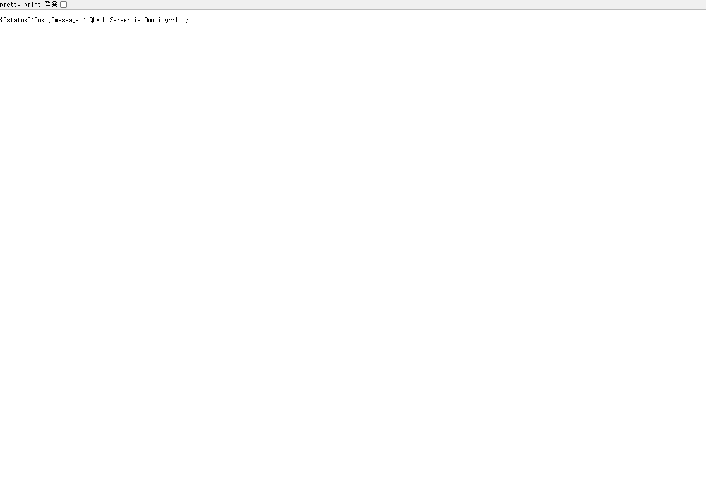
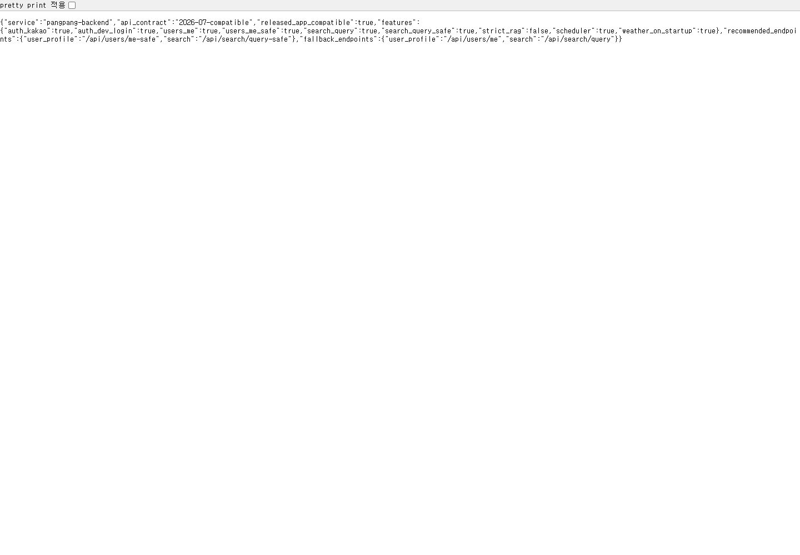
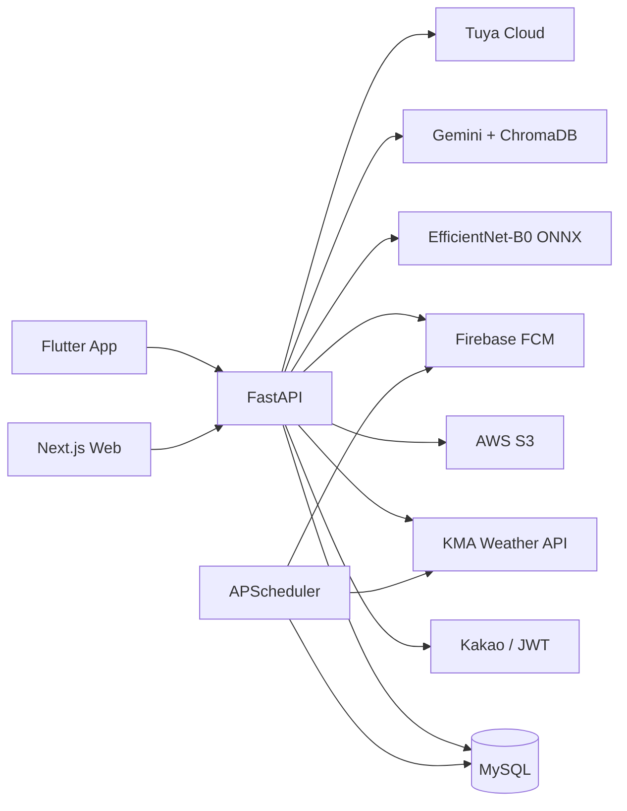
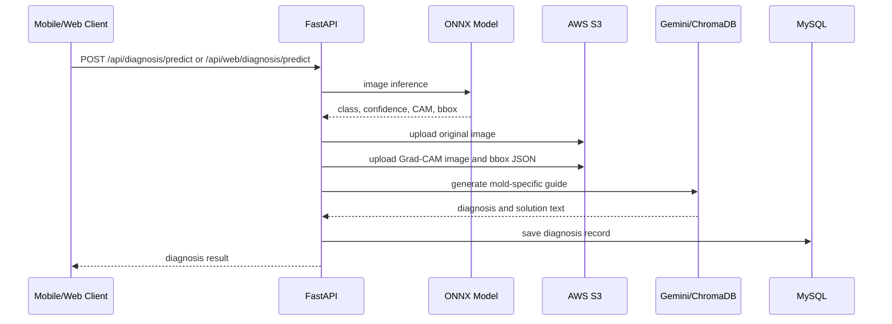

# 팡팡팡 BACK-END

> 출시된 Flutter 앱과 새 웹서비스를 동시에 지원하는 FastAPI 기반 AI 곰팡이 진단 API 서버입니다. 카카오 인증, ONNX 이미지 분석, S3 저장, MySQL 기록, Gemini RAG, 위험도 스케줄러, FCM 알림, IoT 연동을 하나의 운영 API로 제공합니다.


## 서비스 역할

팡팡팡 백엔드는 사용자가 업로드한 곰팡이 이미지를 AI 모델로 분석하고, 분석 결과를 S3와 MySQL에 저장한 뒤 모바일 앱과 웹서비스에 동일한 사용자 데이터로 반환합니다. 이미 Play Store에 출시된 모바일 앱을 보호하기 위해 기존 `/api/*` 계약은 유지하고, 웹 전용 확장은 `/api/web/*`와 capability 기반 feature gating으로 분리했습니다.

## 운영 확인 화면

### 서버 헬스 체크

<p align="center">
  
</p>

### 호환성 매니페스트

웹과 모바일 앱은 `/api/system/capabilities`를 통해 현재 서버가 지원하는 기능을 확인하고, 지원되는 기능만 UI에 노출할 수 있습니다.

<p align="center">
  
</p>

## 핵심 구현

| 영역 | 구현 내용 |
| --- | --- |
| 인증 | Kakao 로그인, JWT Access Token, Refresh Token, logout, 개발/QA용 dev-login |
| 사용자 | 내 정보, 온보딩, 프로필/주거 환경 수정, 탈퇴 |
| AI 진단 | EfficientNet-B0 ONNX 추론, confidence, Grad-CAM, bbox, RAG 해결 가이드 |
| 저장 | 원본 이미지, Grad-CAM 이미지, bbox JSON을 S3에 저장하고 진단 메타데이터를 MySQL에 기록 |
| 곰팡이 사전 | DB 기반 곰팡이 이름, 설명, 위험도, 발생 장소, 제거/예방 방법, S3 이미지 URL 제공 |
| 홈 위험도 | 기상청 데이터와 사용자 주거 정보를 조합해 위험도와 환기 추천 계산 |
| RAG 검색 | Gemini + ChromaDB 기반 곰팡이 질의응답, `query-safe`로 검증된 도감-only 응답 제공 |
| 알림 | Firebase Admin SDK 기반 FCM 토큰 등록, 알림 목록, 읽음 처리, 설정 |
| 게임 | 사과게임 점수 제출, 랭킹, 내 최고점 |
| 운세 | 하루 1회 Gemini 기반 오늘의 팡이 운세 생성/저장 |
| IoT | Tuya Cloud 기반 기기 접근 확인, 목록 조회, 제어 API |
| 호환성 | 출시 앱용 기존 API 유지, 웹 전용 API와 strict 기능을 별도 endpoint/flag로 분리 |

## 시스템 아키텍처



## AI 진단 처리 흐름



## API 계약

### Public / Compatibility

| Method | Endpoint | 설명 |
| --- | --- | --- |
| `GET` | `/` | 서버 헬스 체크 |
| `GET` | `/api/system/capabilities` | 웹/앱 기능 게이팅용 capability |
| `POST` | `/api/auth/kakao` | 모바일 앱 카카오 로그인 |
| `POST` | `/api/auth/refresh` | Access Token 갱신 |
| `POST` | `/api/auth/logout` | 로그아웃 |
| `POST` | `/api/auth/dev-login` | 개발/QA 전용 로그인 |

### Mobile App API

| Domain | Endpoint |
| --- | --- |
| User | `GET /api/users/me`, `GET /api/users/me-safe`, `POST /api/users/onboarding`, `PUT /api/users/profile-info` |
| Home | `GET /api/home/info` |
| Diagnosis | `POST /api/diagnosis/predict` |
| Dictionary | `GET /api/dictionary/list` |
| Search | `GET /api/search/query`, `GET /api/search/query-safe` |
| My Page | `GET /api/my_page/diagnosis-history`, `POST /api/my_page/diagnosis-info/`, `DELETE /api/my_page/delete-diagnosis/` |
| Notification | `GET /api/notifications/`, `GET /api/notifications/unread-count`, `PATCH /api/notifications/{id}/read`, `PUT /api/notifications/settings` |
| Game | `POST /api/game/score`, `GET /api/game/ranking`, `GET /api/game/my-best` |
| Fortune | `GET /api/fortune/today` |
| IoT | `GET /api/iot/access-check`, `GET /api/iot/devices`, `POST /api/iot/devices/{device_id}/control` |

### Web API

| Method | Endpoint | 설명 |
| --- | --- | --- |
| `GET` | `/api/web/auth/kakao/authorize-url` | 웹 카카오 OAuth URL 발급 |
| `POST` | `/api/web/auth/kakao/code` | 웹 OAuth code 교환 |
| `GET` | `/api/web/me/dashboard` | 프로필, 진단 이력, 랭킹, 요약 통합 조회 |
| `GET` | `/api/web/dictionary` | 웹 사전 목록/검색/필터 |
| `GET` | `/api/web/dictionary/{id}` | 웹 사전 상세 |
| `GET` | `/api/web/diagnosis/{id}/public` | 웹 공유 링크용 진단 공개 리포트 조회 |
| `POST` | `/api/web/diagnosis/predict` | 웹 진단 업로드, 저장, 결과 반환 |

## 프로젝트 구조

```text
app/
├─ core/
│  ├─ config.py        # .env 기반 설정
│  ├─ database.py      # SQLAlchemy Async DB 세션
│  ├─ lifespan.py      # 서버 시작 시 DB, AI 모델, 스케줄러 초기화
│  ├─ scheduler.py     # 날씨 수집, 위험도 계산, 알림 작업
│  └─ security.py      # JWT, 인증 유틸
├─ domains/
│  ├─ auth/            # Kakao, JWT, refresh, dev-login
│  ├─ user/            # 내 정보, 온보딩, 프로필, 탈퇴
│  ├─ home/            # 홈 위험도, 날씨, 환기 추천
│  ├─ diagnosis/       # AI 진단, S3 저장, 진단 기록
│  ├─ dictionary/      # 곰팡이 사전
│  ├─ search/          # Gemini + ChromaDB RAG
│  ├─ my_page/         # 진단 이력과 상세 조회
│  ├─ notification/    # FCM 토큰, 알림 목록, 설정
│  ├─ game/            # 점수, 랭킹, 내 최고점
│  ├─ fortune/         # 오늘의 팡이 운세
│  ├─ iot/             # Tuya IoT
│  ├─ system/          # capabilities
│  └─ web/             # 웹 전용 API adapter
├─ middleware.py       # API 접근 로깅
├─ utils/              # S3, 이미지 처리 유틸
└─ main.py             # FastAPI entrypoint
```

## 기술 스택

| 영역 | 기술 |
| --- | --- |
| API | FastAPI, Uvicorn, Pydantic |
| DB | MySQL 8, SQLAlchemy Async, aiomysql |
| Auth | Kakao REST API, JWT, Refresh Token |
| AI Vision | EfficientNet-B0, ONNX Runtime, OpenCV, Pillow, NumPy |
| AI RAG | Gemini, ChromaDB, tiktoken |
| Storage | AWS S3, boto3 |
| Scheduler | APScheduler |
| Notification | Firebase Admin SDK, FCM |
| IoT | Tuya Connector |
| Infra | Docker, Nginx, AWS EC2 |

## 로컬 실행

### 1. 가상환경과 패키지

```bash
python -m venv .venv
.venv\Scripts\activate
pip install -r requirements.txt
```

### 2. 환경 변수

`.env`와 `firebase-admin-key.json`은 Git에 포함하지 않습니다. 로컬 실행에는 다음 계열의 값이 필요합니다.

```env
DATABASE_URL=mysql+aiomysql://<user>:<password>@127.0.0.1:3307/quail_db
SECRET_KEY=...
KAKAO_REST_API_KEY=...
KAKAO_CLIENT_SECRET=... # 카카오 콘솔에서 Client Secret을 켠 경우에만 입력
AWS_ACCESS_KEY_ID=...
AWS_SECRET_ACCESS_KEY=...
AWS_BUCKET_NAME=...
AWS_REGION_NAME=ap-northeast-2
GEMINI_API_KEY=...
FIREBASE_CREDENTIALS_PATH=...
TUYA_ACCESS_ID=...
TUYA_ACCESS_SECRET=...
KMA_API_KEY=...
```

### 3. Docker DB

```bash
docker compose up -d db
```

### 4. API 서버

```bash
uvicorn app.main:app --reload --host 0.0.0.0 --port 8000
```

헬스 체크:

```bash
curl http://localhost:8000/
curl http://localhost:8000/api/system/capabilities
```

## Swagger 문서

`/docs`와 `/openapi.json`은 Basic Auth로 보호됩니다. 운영 환경에서는 인증정보 없이 API 문서가 노출되지 않도록 유지합니다.

## Docker / EC2 운영

`docker-compose.yml`은 다음 서비스를 기준으로 구성됩니다.

| Service | 역할 |
| --- | --- |
| `db` | MySQL 8 |
| `api` | FastAPI 백엔드 |
| `nginx` | HTTPS reverse proxy |

운영 반영 흐름:

```text
EC2 접속 -> git pull -> docker compose restart api/nginx -> 헬스 체크 -> 앱/웹 smoke test
```

운영 도메인 방향:

```text
https://pangpangpangs.com/api  -> FastAPI
https://pangpangpangs.com      -> Next.js WEB
```

## 호환성 원칙

- Play Store에 이미 배포된 모바일 앱이 있으므로 기존 `/api/*` 응답은 깨지지 않게 유지합니다.
- 새 웹 기능은 `/api/web/*`에서 조합하거나 adapter 형태로 제공합니다.
- 더 엄격한 RAG/프로필 검증은 `*-safe` endpoint와 capability로 점진 도입합니다.
- 프론트 릴리즈가 늦어져도 백엔드는 구버전 앱과 신버전 웹을 동시에 처리해야 합니다.

## 검증

로컬에서 확인한 항목:

- `GET /` 200
- `GET /api/system/capabilities` 200
- 웹 로컬 서버에서 백엔드 capability 연동 확인
- Swagger/OpenAPI 문서가 Basic Auth 없이 노출되지 않는지 확인

배포 전 추가 권장 smoke test:

```bash
.\scripts\backend-prod-smoke.ps1
```

점검 항목:

- dev-login은 운영에서 허용 여부를 반드시 확인
- 기존 모바일 앱의 로그인, 홈, 사전, 마이페이지, 진단 상세 API 응답 유지
- 웹의 `/api/web/*` 기능이 기존 `/api/*`와 충돌하지 않는지 확인
- S3 이미지 URL과 Grad-CAM 이미지가 앱/웹 양쪽에서 렌더링되는지 확인
