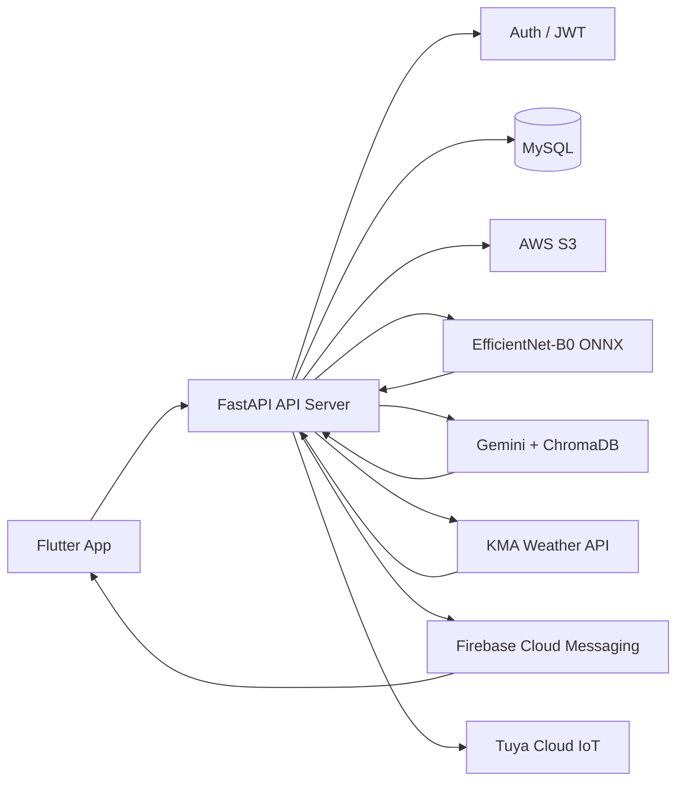
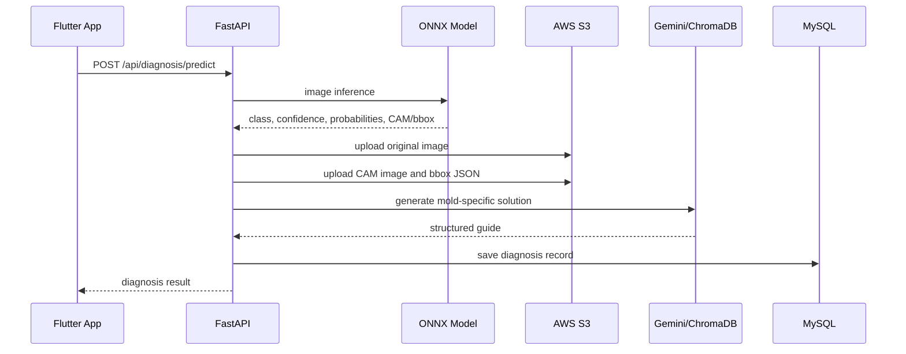

# 팡팡팡 BACK-END

> FastAPI 기반 AI 곰팡이 진단 API 서버. Flutter 앱, ONNX 이미지 분류 모델, MySQL, S3, Gemini RAG, 날씨 스케줄러, FCM 알림, IoT 연동을 하나의 운영 API로 연결합니다.


## 프로젝트 역할

이 저장소는 팡팡팡 서비스의 백엔드 API 서버입니다. 사용자가 Flutter 앱에서 곰팡이 사진을 업로드하면 서버는 이미지를 AI 모델로 분석하고, S3에 결과 이미지를 저장하며, MySQL에 진단 이력을 기록하고, RAG 기반 해결 가이드를 생성해 앱에 반환합니다.

단순 CRUD 서버가 아니라 다음 흐름을 담당합니다.

- 카카오 로그인 및 JWT/Refresh Token 인증
- EfficientNet-B0 ONNX 모델 기반 곰팡이 이미지 분류
- CAM/Bounding Box 기반 AI 판단 근거 이미지 생성
- S3 원본 이미지, Grad-CAM 이미지, JSON sidecar 저장
- MySQL 기반 사용자, 진단, 사전, 날씨, 알림, 게임 데이터 관리
- Gemini + ChromaDB 기반 곰팡이 해결 가이드/RAG 검색
- 기상청 날씨 데이터 수집 및 곰팡이 위험도 스케줄 계산
- FCM 기반 위험도 알림
- Tuya Cloud 기반 IoT 기기 조회/제어 API

## 운영 확인

운영 루트 헬스 체크:

```http
GET https://pangpangpangs.com/
```

응답 예시:

```json
{
  "status": "ok",
  "message": "QUAIL Server is Running~~!!"
}
```

운영 서버는 Nginx가 HTTPS 트래픽을 받고, FastAPI 앱은 내부적으로 8000번 포트에서 동작하는 구조입니다. 외부에서는 8000번 포트에 직접 접근하기보다 도메인 HTTPS 경로를 통해 API를 사용합니다.

## 핵심 성과

| 영역 | 구현 내용 |
| --- | --- |
| API 서버 | FastAPI 라우터를 도메인 단위로 분리하고 JWT 보호 라우터 구성 |
| AI 추론 | ONNX Runtime CPU 실행으로 EC2 t3a.medium 환경에 맞춘 경량 추론 구성 |
| 진단 저장 | 원본 이미지, CAM 이미지, bbox 메타데이터를 S3와 MySQL에 함께 저장 |
| 위험도 관리 | 날씨 데이터와 사용자 주거 정보를 조합해 곰팡이 위험도 계산 |
| 알림 | 위험도 기반 아침 알림 스케줄과 FCM 토큰 등록 API 제공 |
| 문서/운영 | Swagger 문서 보호, Nginx/EC2/Docker 기반 운영 구조 정리 |

## 시스템 아키텍처



## 진단 처리 흐름



## 기술 스택

| 영역 | 기술 | 역할 |
| --- | --- | --- |
| API | FastAPI, Uvicorn, Pydantic | REST API, 요청 검증, Swagger 문서 |
| DB | MySQL 8, SQLAlchemy Async, aiomysql | 사용자/진단/날씨/알림/게임 데이터 저장 |
| Auth | Kakao REST API, JWT, Refresh Token | 카카오 로그인, 토큰 발급/갱신 |
| AI Vision | EfficientNet-B0, ONNX Runtime, OpenCV, Pillow, NumPy | 곰팡이 이미지 분류, CAM/bbox 생성 |
| AI RAG | Gemini, ChromaDB, tiktoken | 곰팡이 해결 가이드 및 검색 응답 생성 |
| Storage | AWS S3, boto3 | 원본 이미지, Grad-CAM 이미지, JSON 메타데이터 저장 |
| Scheduler | APScheduler | 날씨 수집, 위험도 계산, 아침 알림 작업 |
| Notification | Firebase Admin, FCM | 푸시 토큰 등록과 위험도 알림 발송 |
| IoT | Tuya Connector | 사용자 기기 조회 및 전원 제어 |
| Infra | Docker, Nginx, EC2 | 컨테이너 실행, HTTPS 프록시, 운영 배포 |

## 도메인 구조

```text
app/
├─ core/
│  ├─ config.py        # .env 기반 설정
│  ├─ database.py      # SQLAlchemy Async DB 세션
│  ├─ lifespan.py      # 서버 시작 시 DB, AI 모델, 스케줄러 초기화
│  ├─ scheduler.py     # 날씨 수집, 위험도 계산, 알림 작업
│  └─ security.py      # 보안 유틸
├─ domains/
│  ├─ auth/            # 카카오 로그인, JWT, refresh, dev-login
│  ├─ user/            # 온보딩, 내 정보, 프로필, 회원 탈퇴
│  ├─ home/            # 홈 위험도, 날씨, 환기 추천
│  ├─ diagnosis/       # AI 진단, S3 저장, 진단 이력 기록
│  ├─ dictionary/      # 곰팡이 사전
│  ├─ search/          # Gemini + ChromaDB RAG 검색
│  ├─ my_page/         # 진단 이력/상세/삭제
│  ├─ notification/    # FCM 토큰, 알림 목록, 알림 설정
│  ├─ iot/             # Tuya IoT 접근 확인, 기기 조회, 제어
│  ├─ game/            # 점수, 랭킹, 개인 최고 기록
│  └─ fortune/         # 오늘의 운세형 리텐션 기능
├─ middleware.py       # API 접근 로깅
├─ utils/              # S3 storage, CAM image utilities
└─ main.py             # FastAPI 앱 엔트리포인트
```

## 주요 API

### Public

| Method | Endpoint | 설명 |
| --- | --- | --- |
| `GET` | `/` | 서버 헬스 체크 |
| `POST` | `/api/auth/kakao` | 카카오 토큰 기반 로그인 |
| `POST` | `/api/auth/refresh` | Access Token 갱신 |
| `POST` | `/api/auth/logout` | 로그아웃 |
| `POST` | `/api/auth/dev-login` | 개발/QA용 로그인 |

### Private, JWT required

| Domain | Endpoint |
| --- | --- |
| User | `GET /api/users/me`, `POST /api/users/onboarding`, `PUT /api/users/profile-info`, `DELETE /api/users/withdraw` |
| Home | `GET /api/home/info` |
| Diagnosis | `POST /api/diagnosis/predict` |
| Dictionary | `GET /api/dictionary/list` |
| Search | `GET /api/search/query` |
| My Page | `GET /api/my_page/diagnosis-history`, `POST /api/my_page/diagnosis-info/`, `DELETE /api/my_page/delete-diagnosis/` |
| Notification | `POST /api/notifications/register-token`, `GET /api/notifications/`, `GET /api/notifications/unread-count`, `PATCH /api/notifications/{id}/read`, `PATCH /api/notifications/read-all`, `PUT /api/notifications/settings` |
| IoT | `GET /api/iot/access-check`, `GET /api/iot/devices`, `POST /api/iot/devices/{device_id}/control` |
| Game | `POST /api/game/score`, `GET /api/game/ranking`, `GET /api/game/my-best` |
| Fortune | `GET /api/fortune/today` |

## AI 진단 모델

현재 백엔드는 `EfficientNet-B0`를 ONNX로 변환한 모델을 사용합니다.

모델 파일:

```text
app/domains/diagnosis/models/efficientnet_b0_mold.onnx
```

분류 클래스:

| Grade | Class |
| --- | --- |
| `G0` | Not Mold |
| `G1` | Stachybotrys |
| `G2` | Penicillium |
| `G3` | White Mold |
| `G4` | Serratia |

추론 결과에는 top-1 class, confidence, 전체 클래스 확률, CAM heatmap, bbox 좌표가 포함됩니다. 서버는 이 결과를 기반으로 원본 이미지, CAM 이미지, bbox JSON sidecar를 S3에 저장하고 진단 기록을 DB에 남깁니다.

## 스케줄러

서버 시작 시 `lifespan`에서 다음 작업을 등록합니다.

| 시간 | 작업 |
| --- | --- |
| `00:00` | 기상청 날씨 데이터 수집 |
| `01:00` | 사용자별 곰팡이 위험도 계산 |
| `08:00` | 아침 위험도 알림 발송 |

초기 기동 시에는 날씨 데이터가 비어 있을 경우 초기 수집과 위험도 계산을 수행합니다.

## 로컬 실행

### 1. 가상환경 및 패키지 설치

```bash
python -m venv .venv
.venv\Scripts\activate
pip install -r requirements.txt
```

### 2. 환경변수 준비

`.env` 파일은 Git에 포함하지 않습니다. 최소한 다음 항목이 필요합니다.

```env
DATABASE_URL=mysql+aiomysql://<user>:<password>@127.0.0.1:3307/quail_db
KMA_API_KEY=...
DATA_API_KEY=...
KAKAO_REST_API_KEY=...
SECRET_KEY=...
ALGORITHM=HS256

AWS_ACCESS_KEY_ID=...
AWS_SECRET_ACCESS_KEY=...
AWS_BUCKET_NAME=...
AWS_REGION_NAME=ap-northeast-2

GEMINI_API_KEY=...
FIREBASE_CREDENTIALS_PATH=...
TUYA_ACCESS_ID=...
TUYA_ACCESS_SECRET=...
TUYA_UID=...
```

### 3. MySQL 실행

```bash
docker compose up -d db
```

### 4. API 서버 실행

```bash
uvicorn app.main:app --reload --host 0.0.0.0 --port 8000
```

로컬 헬스 체크:

```bash
curl http://localhost:8000/
```

## Docker 구성

`docker-compose.yml`에는 다음 서비스가 정의되어 있습니다.

| Service | 역할 |
| --- | --- |
| `db` | MySQL 8.0 |
| `api` | FastAPI 백엔드 |
| `nginx` | HTTPS reverse proxy |

운영 환경에서는 Nginx가 외부 80/443 요청을 받고 FastAPI 컨테이너로 프록시합니다.

## 배포 방식

현재 운영 배포는 수동 절차입니다.

```bash
ssh -i <pem-key> ubuntu@<ec2-public-ip>
cd <backend-repository>
git pull
docker restart <api-container>
```

EC2 SSH는 Security Group에서 현재 공인 IP의 22번 포트만 제한적으로 허용하는 방식이 안전합니다. DB 3306 포트는 외부에 직접 열지 않고 서버 내부 접속 또는 SSH 터널링으로 접근합니다.

## Swagger 문서

Swagger UI는 기본 `/docs` 경로를 사용하지만, 운영 노출을 줄이기 위해 HTTP Basic 인증으로 보호되어 있습니다.

```http
GET /docs
GET /openapi.json
```

문서 인증 정보는 README나 Git에 기록하지 않습니다.

## 보안 원칙

- `.env`, PEM, AWS Key, Firebase Key, DB 비밀번호는 Git에 포함하지 않습니다.
- S3/IAM 권한은 필요한 범위로 제한합니다.
- DB 포트는 외부 공개보다 SSH 터널링을 우선합니다.
- Swagger 인증 정보는 코드/운영 설정에서 분리하는 방향으로 관리합니다.
- 운영 서버 접근은 Security Group에서 현재 공인 IP만 허용합니다.

## 관련 저장소

- Frontend: [QUAIL-KOREAIT-KDT/FRONT-END](https://github.com/QUAIL-KOREAIT-KDT/FRONT-END)
- Backend: [QUAIL-KOREAIT-KDT/BACK-END](https://github.com/QUAIL-KOREAIT-KDT/BACK-END)
- AI Model: [QUAIL-KOREAIT-KDT/AI_Model](https://github.com/QUAIL-KOREAIT-KDT/AI_Model)
